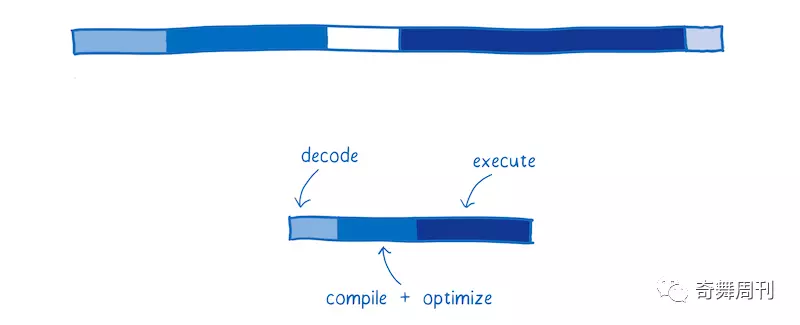

# 调研报告

[TOC]


## 项目成员

雷雨轩

裴启智

刘逸菲

孙一鸣

曲阳

***

***

## 1  项目简介

​		该项目通过高效、安全的Rust语言对17级项目“基于互联网网页的小型分布式文件系统”进行改写，并用极具计算效率和兼容性的WebAssembly来与JavaScript交互实现更高效的网页前端逻辑，并用WebAssembly把Rust写的分布式文件系统程序的包装，再通过Node.js部署Web服务器, 最终在Node.js(V8引擎)实现跨平台的，可提供移动式文件访问的分布式文件系统，并在性能、兼容性、创新性上取得突破。

***

***

## 2  项目背景

​		通过对往届项目研究及操作系统课程的学习，小组成员对于分布式文件系统的工作机制，以及Rust语言的发展很感兴趣。进一步调研发现17级的项目“基于互联网网页的小型分布式文件系统”与我们兴趣点有结合点，便思考在此基础上做出一些改进与学习，尝试加入Rust，并用Webassembly的包装，使得文件系统的实现更具有统一性和普遍性，完全独立于操作系统，而依靠于浏览器存在。为此我们展开了相关调研，内容如下:

### 2.1  DFS调研及选择

分布式文件系统可以有效解决信息爆炸时代存在的成指数倍增长的数据的存储和管理难题：将固定于某个地点的某个文件系统，扩展到任意多个地点/多个文件系统，众多的节点组成一个文件系统网络。每个节点可以分布在不同的地点，通过网络进行节点间的通信和数据传输。人们在使用分布式文件系统时，无需关心数据是存储在哪个节点上、或者是从哪个节点从获取的，只需要像使用本地文件系统一样管理和存储文件系统中的数据。

通过与老师沟通以及对于各个文件系统的考察后，我们发现

* 目前网络上比较流行的商用分布式文件系统如GFS，AFS过于面向大型企业与团体，性能要求高、可靠性要强，只支持在局域网上运行；
* 开源分布式文件系统如Fastdfs，Ceph等代码量也过大，且Fastdfs不是通用文件系统，架构不太合理，与我们课程学习关联较小。
* 17级实现的基于互联网网页的小型分布式文件系统相对轻量，设计思路清晰，而且部分功能尚未完善，在此基础上做改进是可行且有挑战性的。

### 2.2  基于互联网网页的小型分布式文件系统

#### 2.2.1  背景设想

* 高效利用分散在不同设备上的存储空间，方便多人合作办公，避免资源浪费

* 所有安装了客户端的机器共享、贡献存储空间和存储文件碎片；一个专门用于协调处理请求，维持系统状态的服务端；

* 有浏览器的电脑都可访问分布式文件系统

#### 2.2.2  系统结构


#### 2.2.3 各部件组成


#### 2.2.4  相关技术使用及简单分析

* 网络数据传输：基于TCP/IP协议的因特网

* JVM：Java编程实现客户端程序和服务器端程序，这一块涉及到多线程等操作系统的核心原理，是我们利用Rust进行优化性改写的重点部分

* Rrasure Code：原理详见附录，其算法不是我们考虑的重点，17级项目里也是利用的开源的现成代码

* web服务程序及动态网页设计：JS（包含jQuery库），Bootstrap框架，网页与服务器交互ajax，html, json(轻量级数据交换格式)，apache+Tomcat(WEB应用服务器)+Servlet+Java web，Struts2(动态网站网站应用调度框架)，前端的这部分是我们较为陌生的地方，我们还将考虑在此基础上用WebAssembly进行相应优化，具有一定的挑战

* MySQL：实现web服务进程、服务器进程及其各个线程间的数据交换


***

### 2.3  WebAssembly

#### 2.3.1  定义

一种可以使用非 JavaScript 编程语言编写代码并且能在浏览器上运行的技术方案

并不是一门编程语言，而是一份字节码标准，需要用高级编程语言编译出字节码放到 WebAssembly 虚拟机中才能运行， 浏览器厂商需要做的就是根据 WebAssembly 规范实现虚拟机

#### 2.3.2  特点

* 高效：有一套完整的语义，实际上 wasm 是体积小且加载快的二进制格式， 其目标就是充分发挥硬件能力以达到原生执行效率
* 安全：WebAssembly 运行在一个沙箱化的执行环境中，甚至可以在现有的 JavaScript 虚拟机中实现。在web环境中，WebAssembly将会严格遵守同源策略以及浏览器安全策略。相比传统的浏览器插件（Plug-in），WebAssembly 的权限设计更好。传统的插件权力太大，它在后台执行了什么，用户根本不知道。而 WebAssembly 在使用某一项权限时要得到用户的同意才能进行
* 开放：WebAssembly 设计了一个非常规整的文本格式用来、调试、测试、实验、优化、学习、教学或者编写程序。可以以这种文本格式在web页面上查看wasm模块的源码。
* 标准：WebAssembly 在 web 中被设计成无版本、特性可测试、向后兼容的。WebAssembly 可以被 JavaScript 调用，进入 JavaScript 上下文，也可以像 Web API 一样调用浏览器的功能。当然，WebAssembly 不仅可以运行在浏览器上，也可以运行在非web环境下。

***

### 2.4  Rust

#### 2.4.1  特点

* 安全性

  Rust 语言的设计理念是，凡是能够引发程序内存出错的操作，都是不安全的，均不能通过编译。

  Rust 有植入类型系统的生命周期体系，引入了所有权，不允许空指针、悬垂指针、double free、数据竞争等，在编译阶段保证内存安全和线程安全(零开销安全性特点)。

  - 数据竞争问题

    数据竞争（data race）可由这三个行为造成：两个或更多指针同时访问同一数据；至少有一个指针被用来写入数据；没有同步数据访问的机制。

    对于同一作用域内的同一变量，该变量的引用必须满足下述规则之一：默认引用均为不可变引用，不允许修改值；特定作用域中的特定设计最多只有一个可变引用；不能在拥有不可变引用的同时拥有可变引用。

    Rust 通过这样的限制，使可能出现数据竞争的代码不能通过编译。

  - 悬垂指针

    悬垂指针（dangling pointer）是指其指向的内存可能已经被分配给其它持有者的指针，而 Rust 编译器确保数据不会在其被引用之前离开作用域。

  - 引入添加语法来管理生命周期，而且编译器通过租借检查器来说明相关理由。

  程序员可以先使用 unsafe 标签使代码通过编译，再集中调试该代码块。但 unsafe 也仅仅向程序员开放了四种权限：对原始指针进行解引（Dereference raw pointers）；调用 unsafe 函数（包括 C 函数，内部函数，和原始分配器）；实现 unsafe traits；修改（全局）静态变量。

* 高效性能

  性能和标准的 C++ 性能不相上下。

  没有运行时（Run time）和垃圾回收（Garbage Collector），通过生命周期和所有权特性实现内存自动回收，保证了实时性，低开销，适于在嵌入式设备资源匮乏环境下运行。

* 开发环境

  - 有依赖管理工具cargo，可以跨平台编译。
  - 安全问题编译器会代替大量在这块的人肉code review。
  - clippy规定了代码格式，代替了人肉code review。
  - 单元测试语言本身就支持而不用引入测试框架。
  - 对wasm有较完善的支持(详见后文Rust开发WebAssembly的优势)

* 通用性

  不同的编程语言有不同的优点和劣势，程序员希望可以面向不同的需求使用不同的语言。

  Rust 语言是支持外部程序接口调用的，它可以与 C/C++，GO，PHP，Python 混合编程，互相调用。也有各语言的代码转换工具。而 Rust 的无垃圾收集器和较低的运行时需求，都使 Rust 成为被嵌入到其他语言中的一个很好的方案。

* 并发性

  有 `std::thread` 标准库。

  “安全共享可变状态”：

  ​	不允许线程修改外部的可变数据；

  ​	只有实现 Send 接口的数据，才能够在线程间转移所有权；

  ​	使用 channel 同步多个线程，channel 是线程隔离的，无需担心竞争。

  ​	可以使用 lock 保护正在被一个线程使用的数据，确保状态不会意外的被分享。

***

***

## 3  立项依据

### 3.1  WebAssembly

#### 3.1.1  WebAssembly工作原理

* 编译器的“前端”将高级编程语言转换为IR。编译器的“后端”将 IR 转换成目标机器的汇编代码

  

  当前对 WebAssembly 支持最多的编译器工具链称是 LLVM。有许多不同的“前端”和“后端”可以插入到 LLVM 中。假设我们想通过 Rust 来创建 WebAssembly。我们可以使用 clang “前端” 从 Rust 编译成 LLVM 中间代码。当它变成 LLVM 的中间代码（IR）以后，LLVM 可以理解他，所以 LLVM 可以对代码做一些优化，再通过后端将其编译为wasm，如下图

  


#### 3.1.2  为何优于JavaScript

##### WebAssembly和JS在浏览器端的工作过程

* JS引擎中运行JavaScript代码流程：（代表：V8引擎，使用JIT技术)

  

  * Parsing——表示把源代码变成解释器可以运行的代码所花的时间;（文本文件->语法树）
  * Compiling + optimizing——表示基线编译器和优化编译器花的时间。一些优化编译器的工作并不在主线程运行，不包含在这里。
  * Re-optimizing——当 JIT 发现优化假设错误，丢弃优化代码所花的时间。包括重优化的时间、抛弃并返回到基线编译器的时间。
  * Execution——执行代码的时间
  * Garbage collection——垃圾回收，清理内存的时间

* WebAssembly运行流程



##### WebAssembly 比 JavaScript 执行更快的原因

- 文件加载 : WebAssembly 文件体积更小，所以下载速度更快。
- 解析阶段 : WebAssembly 的解码时间比 JavaScript 的解析时间更短;
- 编译和优化阶段 : WebAssembly编译和优化所需的时间较少，因为在将文件推送到服务器之前已经进行了更多优化，且WebAssembly 的代码更接近机器码，而JavaScript 需要先通过服务器端进行代码优化，为动态类型多次编译代码。
- 重新优化阶段 : WebAssembly 不会发生重优化现象，因为编译器有足够的信息可以在第一次运行时获得正确的代码，而 JS 引擎的优化假设则可能会发生“抛弃优化代码<->重优化”现象。
- 执行阶段 : WebAssembly 更快是因为开发人员不需要懂太多的编译器技巧，而这在 JavaScript 中是需要的。WebAssembly 代码也更适合生成机器执行效率更高的指令。
- 垃圾回收阶段：WebAssembly 垃圾回收都是手动控制的，效率比自动回收更高。

* 执行：可以更快地执行，WebAssembly 指令更接近机器码

##### 二者的性能对比

* 下面的图是Unity WebGL使用和不使用WebAssembly的起步时间对比的一个BenchMark。可以看到，在FireFox中，WebAssembly和asm.js的性能差异达到了2倍，在Chrome中达到了3倍，在Edge中甚至达到了6倍。通过这些对比也可以从侧面看出，目前所有的主流浏览器都已经支持WebAssembly V1（Node >= 8.0.0）

  

* 与JavaScript作对比：分别对比WebAssembly版本和原生JavaScript版本的递归无优化的Fibonacci函数，下图是这两个函数在值是45、48、50的时候的性能对比，WebAssembly的性能稳定优于JavaScript几乎一倍.

  

***

### 3.2  Rust

#### 3.2.1  Rust优势及改写理由

- 低功耗：Rust 是少数非常适合在非常低功耗的嵌入式系统的极其受限的资源上运行的语言之一。

- web方面应用：Rust 其中有些应用程序提供的功能是使用 JavaScript无法实现的。Rust 可以编译成 WebAssembly，它以接近原生的速度在每个主要的 Web 浏览器中运行。有一些工具允许通过 WebAssembly 将 Rust 代码发送到 npm（JavaScript 包存储库），然后透明地向下游用户发送，还可以通过绑定将 Rust 部署到 Web 上，这允许调用浏览器和 JavaScript 本身提供的大多数功能。

- 分布式在线服务：对于网络服务， Rust 可以使用最少资源来确保跨多个线程的内存安全，同时 Rust 还使得编写泄漏内存或其他资源的代码变得更加困难，这些方面可以降低服务器成本并降低运营负担。

- 和 Java 相比：

  * 性能：在大多数运行条件下，一个Rust 程序比 Java 消耗的内存会少上一个数量级。

  * 运行时：Java 通过不分配内存的方式努力完善了内存回收机制，以使 GC （垃圾回收器）系统可被管理，但这有时又会导致代码错综复杂。但Rust由于其生命周期及所有权规则可以在没有GC的情况下获取对象，使程序更少地出错。

  * 数据类型：Java的整型操作均是封装好的（并没有溢出检查），而 Rust 会在调试模式时进行溢出检查，在发布模式下进行封装时不做检查。这使得 Rust 在测试期间能够检查溢出发现问题，并在发布版本提高执行效率。借用检查和其他的一些检查，加上默认时的引用不变性，都使 Rust 的鲁棒性更为优秀。

  * 错误处理：在 Rust 中，任何一个线程的 “panics” 都会被认为是 RuntimeExceptions，它会当即终止线程。并且会返回比 Java 更加具体的错误信息，帮助程序员更好的理解错误点，完善代码。

  * 元编程：Java 有既笨拙又缓慢的运行时反射，Rust只需要消耗所需要的资源，因此可以使用宏来实现所需的任何反射功能。这也许需要更多的工作，但是程序员可以完全控制所有内容。

  * 标准库：Rust 的库虽然不如 Java 多，但它们都十分的精确，有几个收集类，大量的字符串处理，智能引用和单元，基本的并发支持，一些IO /网络和最小的OS集成。而且 Rust 可以非常轻松的使用和维护第三方库，这也使得 Rust 程序可以在使用更精简的库的同时，完成同样的功能。

  * 工具：Java 的发展历程要远远长于 Rust，这也就使得 Java 有更多的工具，但目前的很多 Java 工具的代码设置都各不相同，这也就产生了一些混乱的情况。而 Rust 虽然工具不太成熟，但 cargo 等也可以帮助我们正确的编译和管理代码。

  [](https://camo.githubusercontent.com/9a886e8e5658d2594c65beb10a25e04803eb57c3/68747470733a2f2f75706c6f61642d696d616765732e6a69616e7368752e696f2f75706c6f61645f696d616765732f383737303237332d303164356463383466613861636437372e706e673f696d6167654d6f6772322f6175746f2d6f7269656e742f7374726970253743696d61676556696577322f322f772f3438312f666f726d61742f77656270)

- 和 C 和 C++ 相比：

  因为 C 和 C++ 允许空指针引用、释放内存后再使用、返回悬空指针、超出访问权限，是不安全的，将需要花费大量的时间在避免内存问题或者数据竞争问题上；但 Rust 是内存安全的，采取了资源获取即初始化的方法，不必担心内存泄漏和野指针的问题。线程也是安全的，所以也没有任何数据竞争问题，所有的安全性都是由编译器保证的，在大多情况下，编译一旦通过，程序就能安全地运行。

  C++ 没有官方包管理器，这让维护和编译第三方依赖变得异常麻烦和困难，进而导致很长的研发周期。Rust 拥有官方的包管理器 crate ，可以直接使用很多开源的库。

  而且通过 FFI 调用 C 程序是非常快的，不用担心调用 RocksDB API 会有性能上的降低。

- 和 Go 相比：

  Go 的 GC 能修复很多内存问题，但是有时仍然会停止运行中的进程；同时即使我们在测试或运行时使用两次data -race 进行检测，它也没有解决数据竞争问题。Rust 没有 GC 开销，所以不会遇到 “stop the world” 问题。

#### 3.2.2  Rust开发WebAssembly的优势

- 在开发 WebAssembly 时，相比于 AssemblyScript、C++、JavaScript，使用 Rust 开发在开发效率和便捷性、包体积大小等方面有很大优势。
- 用 Rust 开发 WebAssembly 的官方周边文档已经比较全面。
- Rust + WebAssembly 的能力：
  - 可以使用 Rust std以使用 Rust 的大多数第三方库。
  - 可以调用几乎任何 JS 侧声明的方法，也可以暴露方法给 JS 调用。
  - 可以和 JS 侧互相”传递“几乎任何的数据类型，包括但不限于数字、字符串、对象、Dom对象等。
  - 可以直接在 Rust 侧“操作”Dom。
- 很多语言（C、C ++ 和 Rust）都可以在 Web 上共享内存线程，但只有 Rust 可以安全地执行该操作。
- Rust在标准Rust编译器（`rustc`）中构建了自己的WebAssembly工具链。这使Rust开发人员能够将Rust代码编译为WebAssembly模块
- 

***

### 3.3  浏览器

#### 3.3.1  内核调用及web前端实现原理

##### 浏览器组成


浏览器的抽象分层结构图中将浏览器分成了以下8个子系统：用户界面（User Interface）、浏览器引擎（Browser Engine）、渲染引擎（Rendering Engine）、网络（Networking）、JavaScript解释器（JavaScript Interpreter）、XML解析器（XML Parser）、显示后端（Display Backend）、数据持久层（Data Persistence）

* 渲染引擎（Rendering Engine）

  - 主流渲染引擎有：Trident(IE内核)、Gecko（Firefox）、Webkit（Safari）（Presto（Opera）、Blink（Chrome））

  * 渲染引擎为指定的URI生成可视化的表示。

  * 渲染引擎能够显示HTML和XML文档，可选择CSS样式，以及嵌入式内容（如图片）。

  * 渲染引擎能够准确计算页面布局，可使用“回流”算法逐步调整页面元素的位置。

  * 渲染引擎内部包含HTML解析器。

  * 渲染主流程（The main flow）

    渲染引擎首先通过网络获得所请求文档的内容，通常以8K分块的方式完成。

    下面是渲染引擎在取得内容之后的基本流程：

    解析html以构建dom树 -> 构建render树 -> 布局render树 -> 绘制render树


* JavaScript解释器（JavaScript Interpreter）

  JavaScript解释器能够解释并执行嵌入在网页中的JavaScript（又称ECMAScript）代码。 

* XML解析器（XML Parser）

  XML解析器可以将XML文档解析成文档对象模型（Document Object Model，DOM）树。 XML解析器是浏览器架构中复用最多的子系统之一，几乎所有的浏览器实现都利用现有的XML解析器，而不是从头开始创建自己的XML解析器。

* 显示后端（Display Backend）

  显示后端提供绘图和窗口原语，包括：用户界面控件集合、字体集合。

* 数据持久层（Data Persistence）

  数据持久层将与浏览会话相关联的各种数据存储在硬盘上。 这些数据可能是诸如：书签、工具栏设置等这样的高级数据，也可能是诸如：Cookie，安全证书、缓存等这样的低级数据。


#####  JS引擎

*  JS 引擎是附带在浏览器中的处理 JS 脚本的虚拟机。


​	三个概念理解：JavaScript引擎、虚拟机、运行时环境	

​	紫色部分是虚拟机，紫色加灰色是引擎。	运行时可以认为在虚拟机内部

​	引擎: 有可供操作的API。

​	虚拟机: 通过一系列手段，将代码剖析后运行起来，这是引擎的核心组件。

​	运行时:  一组外部约束，用来检测代码在当前环境中安全性、权限等等的东西，比如 node.js 运行时，和浏览器	运行时区别。

* 主流JS引擎和渲染引擎

  

##### 页面呈现原理

  webkit渲染引擎流程如图：

  

  一个页面的呈现，粗略的说会经过以下这些步骤：

  ```
1. DOM 树的构建（Parse HTML）
2. 构建 CSSOM 树（Recaculate Style） 为什么是 Re-caculate Style 呢？这是因为浏览器本身有 User Agent StyleSheet，所以最终的样式是我们的样式代码样式与用户代理默认样式覆盖/重新计算得到的。
3. 合并 DOM 树与 CSSOM 树为 Render 树
4. 布局（Layout）
5. 绘制（Paint）
6. 复合图层化（Composite）图层化是自己理解后形象的意译其中布局（Layout）环节主要负责各元素尺寸、位置的计算，绘制（Paint）环节则是绘制页面像素信息，合成（Composite）环节是多个复合层的合成，最终合成的页面被用户看到。
  ```

  - 当遇到 JavaScript 脚本或者外部 JavaScript 代码时，浏览器便停止 DOM 的构建（阻塞 1）(此方面上WebAssembly比 JS 效率更高）

  - 当遇到 /<script> 标签需要执行脚本代码时，浏览器会检查是否这个 <script> 标签以上的 CSS 文件是否已经加载并用于构建了 CSSOM，如果 <script> 上部还有 CSS 样式没加载，则浏览器会等待 <script> 上方样式的加载完成才会执行该 <script> 内的脚本（阻塞 2）

- DOM 树与 CSSOM 树的成功构建是后面步骤的根基（同步阻塞）

  同时外部脚本、外部样式表的下载也是耗费时间较多的点
  
  

#### 3.3.2  文件上传与下载

##### 上传原理

* 核心：FileUpload对象

  网页上传文件核心：HTML DOM的FileUpload对象

```javascript
<input type="file">
```

​	在 HTML 文档中该标签每出现一次，一个 FileUpload 对象就会被创建。该标签包含一个按钮，用来打开文件选择对话框，以及一段文字显示选中的文件名或提示没有文件被选中。

​	把这个标签放在``标签内，设置form的action为服务器目标上传地址，并点击submit按钮或通过JS调用form的submit()方法就可以实现最简单的文件上传了。

```javascript
<form id="uploadForm" method="POST" action="upload" enctype="multipart/form-data">
      <input type="file" id="myFile" name="file"></input>
      <input type="submit" value="提交"></input>
 </form>
```

​	问题：上传同步、上传完成页面会刷新（所以没人直接这么用，才有了下面的两种）

* XMLHttpRequest Level 2/ Ajax（高版本浏览器）

  功能：通过在后台与服务器进行少量数据交换，AJAX 可以使网页实现异步更新。这意味着可以在不重新加载整个网页的情况下，对网页的某部分进行更新。

  Ajax所包含技术

  * 使用CSS和XHTML来表示。

  * 使用DOM模型来交互和动态显示。

  * 使用XMLHttpRequest来和服务器进行异步通信。

  * 使用 JavaScript来绑定和调用。
  * 核心是XMLHttpRequest对象（不同浏览器创建的方法有差异）

  Ajax工作原理

  Ajax的工作原理相当于在用户和服务器之间加了—个中间层(AJAX引擎)，使用户操作与服务器响应异步化。并不是所有的用户请求都提交给服务器。像—些数据验证和数据处理等都交给Ajax引擎自己来做,只有确定需要从服务器读取新数据时再由Ajax引擎代为向服务器提交请求。


​	上图是Ajax和传统方式的对比图，可以看到Ajax相当于一个中间层。

​	下面两图对比了交互方式的不同：

​		浏览器的普通交互方式


​		浏览器的Ajax交互方式


​	从这两张图可以看出，Ajax使用户操作与服务器响应异步化。


* iframe + form （较低版本浏览器）

  低版本的IE里的XMLHttpRequest是Level 1，所以不能通过XHR异步向服务器发上传请求，故只能用form的submit。跨域问题借用JSONP

  主流浏览器都支持 Ajax ，故对此不作详细介绍

- 开源的拿来即用的前端上传插件比较多，诸如:Web Uploader、JSAjaxFIleUploader、
  jQuery-File-Upload，通常这些上传插件包含的功能有：选择上传、支持拖拽、MD5校验、图片预览、上传进度显示等功能


##### 下载原理

- 原生提交，后端返回文件流：利用form.submit直接向后端提交,后端返回文件流生成的文件，后端处理成功后会直接返回到页面，浏览器会整理并打开下载文件 。
  优点 ：没有兼容问题，是一种传统方式
  缺点：无法得到后端处理这个过程的时机，无法根据回调函数做交互以及进度提示

- ajax提交，后端返回在线文件地址：利用ajax或者新生的axios去提交请求，后端会返回一个线上的文件地址，前端可以通过原生的window.open打开这个地址就可以实现下载；也可以通过a标签设置href以及download属性，并自动点击实现其下载功能，关于其兼容性问题，可以判断download属性是否存在来弥补。
  优点 ：可以拿到其返回时机，可以做交互
  缺点 ：线上会存储大量的中间临时文件，可以用设置时限来优化。另外涉及用户隐私的问题，可以用token等验证机制实现。

- 前端利用download模块进行下载：其对应的下载文件方案包括了以下几种。

  window.open(url)打开某个文件地址
  iframe的框架中，设置src属性，通过iframe进行文件的下载，支持文件地址
  通过form标签，设置action的文件地址，然后通过form的提交来完成文件的下载（支持二进制）

  对于常规的支持文件地址的下载，兼容性非常好，而对于传统的文件流性质的，通过form标签也可以进行简单的支持。

#### 3.3.3  Node.js 工作原理

##### 基础架构


​		上图是 Node.js 的内部结构图。自底向上主要分成三层：最底层是 Node.js 依赖的各种库，有 V8、libuv 等；	中间层是各种 Binding，也就是胶水代码；最上层是应用代码，可使用 Node.js 的各种 API。

* 最底层：Node.js 依赖的库

- V8
  Google 开源的高性能 JavaScript 引擎，它将 JavaScript 代码转换成机器码，然后执行，因此速度非常快。V8 以 C++ 语言开发，Google 的 Chrome 浏览器正是使用的 V8 引擎。

- libuv
  libuv 以 C 语言开发，内部管理着一个线程池。在此基础之上，提供事件循环（Event Loop）、异步网络 I/O、文件系统 I/O等能力。

- 其他底层依赖库
  如 c-ares、http-parser以及 zlib。这些依赖提供了对系统底层功能的访问，包括网络、压缩、加密等。

- 中间层 Binding：桥接作用

  Node.js 底层的依赖库，以 C/C++等多种不同 语言开发，如何让应用代码（JavaScript）能够与这些底层库相互调用呢？这就需要中间层的 Binding 来完成。Binding 是一些胶水代码，能够把不同语言绑定在一起使其能够互相沟通。在 Node.js 中，binding 所做的就是把 Node.js 那些用 C/C++ 写的库接口暴露给 JS 环境。

  中间层中，除了 Binding，还有 Addon。Binding 仅桥接 Node.js 核心库的一些依赖，如果你想在应用程序中包含其他第三方或者你自己的 C/C++ 库的话，需要自己完成这部分胶水代码。你写的这部分胶水代码就称为 Addon。本质上都是完成桥接的作用，使得应用与底层库能够互通有无。

- 最上层：应用层

  开发的应用、npm 安装的包等都运行在这里。

##### 事件循环

 - Node.js 工作流程：


​	一个 Node.js 应用启动时，V8 引擎会执行你写的应用代码，保持一份观察者（注册在事件上的回调函数）列表。当事件发生时，它的回调函数会被加进一个事件队列。只要这个队列还有等待执行的回调函数，事件循环就会持续把回调函数从队列中拿出并执行。

​	在回调函数执行过程中，所有的 I/O 请求都会转发给工作线程处理。libuv 维持着一个线程池，包含四个工作线程（默认值，可配置）。文件系统 I/O 请求和 DNS 相关请求都会放进这个线程池处理；其他的请求，如网络、平台特性相关的请求会分发给相应的系统处理单元进行处理。

​	安排给线程池的这些 I/O 操作由 Node.js 的底层库执行，完成之后触发相应事件，对应的事件回调函数会被放入事件队列，等待执行后续操作。这就是一个事件在 Node.js 中执行的整个生命周期。

- 事件循环处理过程：

  一次事件循环，大概可以分为如下几个阶段：


> 图中每一个方块，在事件循环中被称为一个阶段(phase)。

​	每个阶段都有自己独有的一个用于执行回调函数的 FIFO 队列。当事件循环进入一个指定阶段时，会执行队列中	的回调函数，当队列中已经被清空或者执行的回调函数个数达到系统最大限制时，事件循环会进入下一个阶段

* 上图中总共有6个阶段：
  * timers: 该阶段执行由 `setTimeout()` 和 `setInterval()` 设置的回调函数。
  * I/O callbacks: 执行除了close 回调、timers 以及
    `setImmediate()` 设置的回调以外的几乎所有的回调。
  * idle,prepare: 仅供内部使用。
  * poll: 检索新的 I/O 事件；在适当的时候 Node.js 会阻塞等待。
  * check: 执行 `setImmediate()` 设置的回调。
  * close callbacks: 执行关闭回调。比如： `socket.on('close', ...)`.

这里有个令人困惑的地方，`I/O callbacks` 与 `poll` 这两个阶段有什么区别？ 既然 `I/O callbacks` 中已经把回调都执行完了，还要 `poll` 做什么？

查阅了libuv 的文档后发现，在 libuv 的 event loop 中，`I/O callbacks` 阶段会执行 `Pending callbacks`。绝大多数情况下，在 `poll` 阶段，所有的 I/O 回调都已经被执行。但是，在某些情况下，有一些回调会被延迟到下一次循环执行。也就是说，在 `I/O callbacks` 阶段执行的回调函数，是上一次事件循环中被延迟执行的回调函数。

还需要提到的一点是 `process.nextTick()`。`process.nextTick()` 产生的回调函数保存在一个叫做 `nextTickQueue` 的队列中，不在上面任何一个阶段的队列里面。当当前操作完成后，`nextTickQueue` 中的回调函数会立即被执行，不管事件循环处在哪个阶段。也就是说，在 `nextTickQueue` 中的回调函数被执行完毕之前，事件循环不会往前推进。

***

## 4  重要性/前瞻性分析

### 4.1  WebAssembly

#### 4.1.1  发展趋势与需求

* WebAssembly 只是允许了更多的语言能编译运行而 JavaScript 作为快速发展的语言, 很可能会被一直支持下去的，两种语言很可能会被长期共用下去, 比如性能要求高的部分用 WebAssembly，而对性能要求不高的部分用JavaScript

* 比JavaScript引擎更一致地工作

  Wasm也可以在JavaScript虚拟机中运行，但是它表现得更好。两者可以自由交互、互不排斥，这样就同时拥有了两者最大的优势——JavaScript巨大的生态系统和有好的语法，WebAssembly接近原生的表现性能。如今市场上可用的每种浏览器都使用不同的JavaScript引擎。引擎基本上将要运行的代码解析为一个抽象语法树，该语法树会生成字节码。不同的JavaScript引擎有时无法以相同的方式解析目标代码，因为它们的实现方式不同，并且可以进行不同的优化。而WebAssembly的实现需要较少的优化和类型假设，因此它将比JavaScript引擎更加一致。

* 提供了一个很好的Web编译目标，因此人们可以选择将其网站编码为哪种语言

* WebAssembly支持可管理的线性内存，连续范围的无类型字节

* WebGUI：GUI由许多控件组成，需要准确、快速的放置它们，而基于WebAssembly的C、C++、Rust程序快速地在屏幕上放置大量字节

  

* 某些平台提供对最大16GiB的内存页面的支持，在某些情况下可以提高内存管理的效率。而WebAssembly可以为程序提供指定比默认大小更大的页面大小的选项

* WebAssembly 适合用于需要大量计算的场景，例如：

  * 在浏览器中处理音视频，flv.js用 WebAssembly 重写后性能会有很大提升
  * React 的 dom diff 中涉及到大量计算，用 WebAssembly 重写 React 核心模块能提升性能。Safari 浏览器使用的 JS 引擎 JavaScriptCore 也已经支持 WebAssembly，RN 应用性能也能提升
  * 突破大型 3D 网页游戏性能瓶颈

#### 4.1.2  面临的局限与对策

**难题**

* JS也在不断的改进，弥补它一些天生的不足，发扬其轻快便捷的语言优势，其现行有很多框架，如React/Angular/Vue，这些框架都是有惯性的，不可能立即摒弃

* 至少在当下，在很多场景下(数据量和运算复杂度不是很高)，wasm对比 JS(jit优化后的)，并没有多大优势

* WebAssembly 的性能优于 JS，但是低于node.js的原生模块或者是 C 的原生模块。所以如果不是运行在浏览器环境中，不用特意的转化成WebAssembly

* WebAssembly能做到的事情 JS 都能做到，至少目前还没有发现什么是wasm能做，而 JS 不能的

* WebAssembly具有一些重要的设计约束，这些约束会影响其当前的使用方式，其中包括：
  - 仅支持4种类型-全数字
  - 模块无法直接访问DOM（文档对象类型）或WebAPI
  - 模块可以导入/导出函数（但只能接收/返回wasm数字类型）
  - 没有垃圾收集器，故垃圾收集语言不适用于WebAssembly

**对策**

* 我们项目的目的便是让分布式文件系统整体能部署在Node.js的环境中，乃至直接运行在浏览器环境下，如此来充分利用WebAssembly高通用性和高性能的特性

* JavaScript API + WebAssembly Core ：

  上层 JS，引擎渲染内核为WebAssembly，可以正常用 JS 的API(通过ArrayBuffer交换数据流)。这样，通过对JS 的调用，仍能利用 JS 一些现成框架，并且通过 JS 可以调用WebAssembly 无法直接访问的 DOM

* 把密集型大型计算工作交由WebAssembly解决

  把Rust语言和前端都打包为wasm，多进行一次性的密集计算而非简单将特定几个函数编译为WebAssembly，可以有效提高对WebAssembly高计算性能的利用效率

- 不止于浏览器:

  WebAssembly 作为一种底层字节码，除了能在浏览器中运行外，还能在其它环境运行。

  * 直接执行 wasm 二进制文件

    *  Binaryen 提供了在命令行中直接执行 wasm 二进制文件的工具，在 Mac 系统下通过 brew install binaryen 安装成功后，通过 wasm-shell f.wasm 文件即可直接运行。

  * 在 Node.js 中运行

    * 目前 V8 JS 引擎已经添加了对 WebAssembly 的支持，Chrome 和 Node.js 都采用了 V8 作为引擎，因此 WebAssembly 也可以运行在 Node.js 环境中；

      V8 JS 引擎在运行 WebAssembly 时，WebAssembly 和 JS 是在同一个虚拟机中执行，而不是 WebAssembly 在一个单独的虚拟机中运行，这样方便实现 JS 和 WebAssembly 之间的相互调用。

    * 通过 C、Rust 去编写 WebAssembly，可直接编译成 Node.js 可以调用的原生模块。

***

### 4.2  Rust

#### 4.2.1  发展趋势及学习需求

- Rust 在拥有可以媲美 C 和 C++ 的性能的同时，也拥有极高的安全性和高度控制性，可以避免因为使用 C 和 C++ 而造成的很多漏洞。未来也许有望取代 C/ C++。
- Rust 语言本身有一条开发规范，如结构体、trait 等要求首字母大写、驼峰命名，函数要求蛇形命名法等，因此非常利于项目组统一风格。
- Rust 具有令人信服的高效性，据统计，有超过 40% 的 Rust 用户在不到一个月的使用内即感受到 Rust 语言的高效性，并且连续4年，在Stack Overflow开发者「最受喜爱编程语言」评选中获得第一名。
- 使用 Rust 语言的项目的规模和数目都在不断增大，近来，越来越多的著名项目已经选择使用 Rust 作为其开发语言，包括：Parity、Polkadot等众多知名度较高的项目。
- 支持 Rust 的平台逐渐多样化，如 Windows， Linux 和 Android 等很多大平台都可以支持 Rust 运行。
- 越来越多的公司开始对 Rust 语言表现出浓厚的兴趣，如 Google、Facebook、Twitter 等公司和国内的百度、阿里都开始使用 Rust 来编写或维护项目，但能够熟练使用 Rust 的程序员仍是少数，未来市场将对 Rust 程序员表现出更大的需求量。
- RUST对 wasm 的支持可能是所有高级语言中最完整的
- Rust使用户有机会管理内存，同时也提供了内存安全性

#### 4.2.2  存在的问题

- Rust 学习曲线比较陡峭，是比较难掌握的一门语言。
- 编译时间较长。
- 相应的库和工具仍然比较缺乏。
- 需要更优秀的 IDE。

#### 4.2.3  学习难度，改写的可行性

- Rust 周边文档对于新手较为友好，官方说明文档十分详实，我们都拥有 C 和 C++ 语言的编程经历，可以在一两周内初步上手，采取 ”小步快跑“ 的学习模式，将项目分块进行改写，在语言学习方面可行。
- 基于互联网的小型分布式文件系统是一个轻量级的文件系统，由 Java 编程，代码量约有千余行，用 Rust 改写其中一部分或者全部的工作量是可以接受的。
- Rust 的通用性决定了程序员可以在 Rust 程序中调用 Java 模块，这使得我们可以仅仅改写项目中的一部分重要的代码，其他部分可以调用原有代码。


## 5  相关工作

### 5.1  Rust

**较为成功的Rust开发的项目**

- Servo: 

  Servo是高性能、并行浏览器引擎。适用于浏览器应用和嵌入式应用，是下一代浏览器渲染引擎（类Webkit/Blink），拥有超过25万行 Rust 代码量。

  Servo跟Rust并行开发。其里程碑的意义是，它实践并印证了Rust语言具有实际的大中型项目开发能力。

  Servo采用Rust编程语言编写，使浏览器内部有高性能和内存安全性，大幅减少影响浏览器引擎的关键错误数量。采用模块化架构，目前可运行在Linux、macOS、Windows和Android操作系统上。

- rustc+std: Rust编译器和标准库，超过30万行Rust代码。

  时至今日，rustc负责编译全世界所有的Rust源代码，包括rustc+std的30万行和servo的25万行，以及crates.io网站上的2000多个第三方库，是名副其实的大型成功项目。

- Cargo: Rust的package管理器，项目依赖管理。

  代码量相比前两者而言要小的多，代码虽少，但实用性、流行度有过之而无不及。全世界大约99%的Rust项目采用Cargo编译。crates.io网站上有2000多个包，总下载量超150万次。Cargo最大幅度地简化了Rust项目的编译和依赖管理，可以说是目前开发Rust项目的必备工具。

- TiKV

  TiKV 是一个分布式的 Key-Value 数据库。其特点有：异地复制 ；水平扩展 ；一致性分布式事务；分布式计算的协处理器 。

  其需求的语言应拥有如下优点：快速；内存安全；线程安全；和 C 高效绑定。所以选择了 Rust。

### 5.2  WebAssembly

**在大型项目中的应用**

* AutoCAD

  * 一个用于画图的软件，在很长的一段时间是没有Web的版本的，原因有两个，其一，是Web的性能的确不能满足他们的需求。其二，在WebAssembly没有面世之前，AutoCAD是用C++实现的，要将其搬到Web上，就意味着要重写他们所有的代码，这代价十分的巨大。

    而在WebAssembly面世之后，AutoCAD得以利用编译器，将其沉淀了30多年的代码直接编译成WebAssembly，同时性能基于之前的普通Web应用得到了很大的提升。正是这些原因，得以让AutoCAD将其应用从Desktop搬到Web中。

* Google Earth

  * Google Earth也就是谷歌地球，因为需要展示很多3D的图像，对性能要求十分高，所以采取了一些Native的技术。最初的时候就连Google Chrome浏览器都不支持Web的版本，需要单独下载Google Earth的Desktop应用。而在WebAssembly之后呢，谷歌地球推出了Web的版本。而据说下一个可以运行谷歌地球的浏览器是FireFox

* Unity和Unreal游戏引擎

* 爱奇艺直播

  爱奇艺生产的直播流有mp4和flv两种格式，但Html5的video标签原生只支持mp4的播放，所以爱奇艺需要解决flv格式在网页端播放的问题。

  爱奇艺直播采用“在网页端将 flv 格式转成 mp4 格式，当flv的数据流到达前端时，使用JavaScript将flv转换成mp4，再交给原生播放器。但由于JavaScript运行效率较低，这部分的性能令人不太满意，所以爱奇艺决定引入WebAssembly技术，替换原来的JavaScript所写的转码模块。实现提升转码速度，cpu占用率下降的目标，同时仍能满足流畅观看直播的需求。

  接入WebAssembly所需步骤：

  * 使用C编写flv转mp4的代码

  * 使用emcc编译出flv2Mp4.js和flv2Mp4.wasm

  * 对接编译好的wasm文件

  

* bilibili web投稿页面（更加快速地在网页端解析视频）

  当你的视频还在上传中，已经可以自由选择AI推荐的封面。这里采用了WebAssembly+AI的前端整合。


​	WebAssembly 负责读取本地视频，生成图片；

​	tensorflow.js 负责加载AI训练过的model，读取图片并打分。

​	从完全的服务端架构 -> 前端架构 && 服务端兜底。

​	WebAssembly支持解析99%以上的视频编码格式，速度提升体验惠及约50%的web投稿用户

###  5.3 白鹭引擎

#### 5.3.1  背景知识

- HTML 5 游戏引擎：开发效率、加载效率、运行效率（WebAssembly提升之处）

- 渲染内核原理

  


例：用户逻辑：每一帧向下移一像素

​		引擎逻辑：将用户的“向下移一个像素”转换成浏览器底层渲染API了解的，比如：矩阵变换

​		渲染逻辑：将结果传给WebGL接口

2014年，由于浏览器的接口很差，渲染很慢，所以性能由“渲染逻辑”决定。通过WebGL，硬件优化等等，浏览器内核内核提升后，性能问题转换到“引擎逻辑”。那么如何进一步提升JavaScript的运行效率？

虽然V8 JS引擎中的 JIT 使得JavaScript的效率大幅增加，但效率已经被压榨到了极限，web开发者开始考虑重新设计一门web用的语言，那么他应该有下面三个特性：

- 面向机器，而非面向开发者。不应该是文本，可以编译成汇编
- 强类型，而非运行时推断类型
- 使用更可控的垃圾回收机制：垃圾回收会让整个JS引擎停止，所以垃圾回收不应该交给虚拟机做

#### 5.3.2  WebAssembly架构


两层编译的好处：支持WebAssembly的浏览器可以直接运行.wasm，不支持的浏览器可以运行.asm.js 

#### 5.3.3  WebAssembly在游戏引擎中的应用

几种可能的实现方法：

- Native 浏览器插件：相对性能最高，但不是HTML 5标准 eg. Flash player 

- JavaScript + HTML5 API（现在的HTML5游戏引擎采用）

- Native Code to WebAssembly

  理论上可以，但不现实。原生游戏体积大，游戏开始时就要下载很多资源，不现实。此外，还要考虑web的一些特性，难以实现。

- JavaScript API + WebAssembly Core （白鹭引擎采用）

  上层JS，引擎渲染内核为WebAssembly，可以正常用JS的API

#### 5.3.4  白鹭引擎 WebAssembly 内核核心原理

- 白鹭引擎对外提供 JavaScript API

- 开发者编写的JavaScript逻辑代码会汇总为一组命令队列发送给
  WebAssembly层（即引擎内核层）

- 然后WebAssembly建立对渲染节点的抽象封装，并在每一帧对
  这些渲染节点进行矩阵计算、渲染命令生成等逻辑

  这个机制与浏览器实现机制相似，创建一棵树，在树上存储所有命令之后再重新生成，然后计算每一帧的渲染节点，JavaScript中计算矩阵慢，而WebAssembly快

- 生成组ArrayBuffer数据流

  由于WebAssembly和JavaScript交互很差，所以用ArrayBuffer(相当于JS和WebAssembly都可以用的内存)来传递数据

- 最后JavaScript对这组数据流（WebAssembly渲染出的数据流）进行简单的解析并直接调用DOM的WebGL接口

  由于WebAssembly不能调用DOM，所以不得不传回 JS 调用


**需注意一些问题**:

 - JavaScript与WebAssembly的对象互相调用性能很差

   ->使用ArrayBuffer共享（JS与WebAssembly共享）性能有些慢，但可以接受

 - 简单地将特定的几个函数编译为WebAssembly，然后交由JavaScript去调用的方式反而会因为频繁的互相操作反而造成性能下降

   ->进行一次性的密集计算

 - WebAssembly不存在垃圾回收机制

   -> 需要手动删除垃圾，而JavaScript开发者已经习惯于垃圾回收机制

### 5.4  邮箱上传和扫描文件方面的应用

* 核心：LLVM，emscripten，JS/wasm/浏览器通信

* 流程：编译前端 LLVM / Emscripten 流程可以获得 wasm 文件和胶水 JS。然后，通过胶水 JS 来加载 wasm 并转为 arrayBuffer 格式。紧接着进行编译和实例化后，即可用 JavaScript 与 WebAssembly 通信。

  

  

* LLVM的简单解释

  * LLVM本质上是一系列帮助开发编译器、解释器的SDK(软件开发工具包)集合，按照传统编译器三段式的结构来说，更接近于优化层（Optimizer）和编译后端（Backend），而不是一个完整的编译器

    

  * LLVM在优化层，对中间代码IR来执行代码的优化，它独特的地方在于IR的可读性很高

  * 作为SDK集合的LLVM还提供了一些工具，用来支持代码复用、多语言、JIT，文档也比较友善

* emscripten

  * emen的编译平台fastcomp负责将LLVM IR转化为特定的机器码或者其他目标语言（包括wasm）。在这里，emen其实扮演了编译器后端的角色（LLVM Backend）

  * JS/wasm/浏览器的调用关系

    * 业务JS：实现需要的功能
    * 胶水JS：提供和暴露接口，用于代码间的交互
      * JavaScript胶接代码（glue code），用于连接相互不兼容的软件组件

    

  * 与JS相比的优势：比JS更直接的映射为机器码，这是由它所处在IR和机器码之间决定的

  * 达到的效果：扫描1.9G文件耗时约12.1秒，扫描速度可以到160M/s。速度达到了原有速度（75M/s）的2.1倍左右


## 6  参考文献

<details>
<summary>CSDN</summary>
<pre>
<a href="https://baijiahao.baidu.com/s?id=1622998388358453257&wfr=spider&for=pc"> Rust 与 C 相比的优势</a>
<a href="https://blog.csdn.net/csdnnews/article/details/86570676">Rust 与 C++ 相比的优势</a>
<a href="https://blog.csdn.net/liigo/article/details/45757123">为什么 Rust 是可靠的</a>
<a href="https://blog.csdn.net/weixin_37580235/article/details/81459282">Ajax 工作原理和实现步骤</a>
<a href="https://blog.csdn.net/cpongo1/article/details/89548574?depth_1-utm_source=distribute.pc_relevant.none-task&utm_source=distribute.pc_relevant.none-task">WASM发展状况以及 LLVM-wasm 编译环境搭建过程</a>
</pre>
</details>
<details>
<summary>简书</summary>
<pre>
<a href="https://www.jianshu.com/p/e963d92c5697">Rust 并发</a>
</details>
<details>
<summary>Cnblog</summary>
<pre>
<a href="https://www.cnblogs.com/onepixel/p/5090799.html">JS 引擎工作原理</a>
<a href="https://kb.cnblogs.com/page/129756/">浏览器内部工作原理</a>
</details>
<details>
<summary>其他论坛</summary>
<pre>
<a href="https://www.techug.com/post/how-webassembly-works.html">WebAssembly 工作原理</a>
<a herf="https://cloud.tencent.com/developer/news/464897">爱奇艺直播的 WebAssembly 优化</a>
<a herf="https://www.sohu.com/a/283054773_495695">WebAssembly 在 QQ 邮箱中的应用</a>
<a herf="https://www.zhuanzhi.ai/document/647669c1fc82b6599ddafb510be3d381">微信小程序支持webP的WebAssembly方案</a>
</details>
<details>
<summary>知乎</summary>
<pre>
<a href="https://www.zhihu.com/question/362330696/answer/947113477"> Rust 比起 C++ 的强处</a>
<a href="https://www.zhihu.com/question/30407715/answer/48032883">如何看待 Rust 的应用前景</a>
<a href="https://www.zhihu.com/question/265700379">效果拔群的 WebAssembly 应用</a>
</pre> 
</details>
<details>
<summary>极客学院</summary>
<pre>
<a href="https://wiki.jikexueyuan.com/project/rust/concurrency.html"> Rust 语言中文版- Rust 并发性</a>
</pre> 
</details>
<details>
<summary>Rust 语言中文社区</summary>
<pre>
<a href="https://rust.cc/article?id=37bfd307-b273-4147-9548-0edd670a8b7d"> Rust 语言和其他语言的相互调用</a>
</pre> 
</details>
<details>
<summary>techrepublic</summary>
<pre>
<a href="https://www.techrepublic.com/article/rust-programming-language-seven-reasons-why-you-should-learn-it-in-2019/"> 2019 年你应该学 Rust 的理由</a>
</pre> 
</details>
<details>
<summary>往届大作业项目</summary>
<pre>
<a href="https://github.com/OSH-2019/x-rust-freertos/blob/master/docs/feasibility.md"> 使用 Rust 改写 FreeRTOS </a>
<a herf="https://github.com/OSH-2019/x-i-m-feeling-lucky/blob/master/docs/feasibility.md#3-rust-programming-language">Rust 编写一个能在树莓派上运行的操作系统</a>
</pre> 
</details>

[Rust Programming Language](https://www.rust-lang.org/)

[Rustwasm Book](https://rustwasm.github.io/book/)

[WebAssembly.org](https://webassembly.org/docs/future-features/)

[The Future of WebAssembly](https://blog.scottlogic.com/2018/07/20/wasm-future.html)

## 7  附录

### Erasure code

* 擦除编码（简称EC）是一种数据保护方法，其中数据被分解成碎片，并用冗余数据块进行扩展和编码，并存储在一组不同的位置或存储介质中

* EC的目的是使磁盘存储过程中某个时刻损坏的数据能够通过使用有关存储在阵列其他位置的数据的信息来重建。擦除码通常可以代替传统RAID使用，因为它们能够减少重建数据所需的时间和开销。擦除编码的缺点是它可能会占用更多CPU资源，并且会转化为增加的延迟

* EC对于大量数据以及需要容忍故障的任何应用程序或系统（例如磁盘阵列系统，数据网格，分布式存储应用程序，对象存储和档案存储）很有用。基于擦除的一种常见的当前用例是基于对象的云存储

* 擦除编码创建一个数学函数来描述一组数字，以便可以检查它们的准确性，如果丢失则可以恢复。称为多项式插值或过采样，这是擦除码背后的关键概念。用数学术语，擦除编码提供的保护可以用以下等式简单表示：n = k + m。变量“ k”是数据或符号的原始数量。变量“ m”代表添加的多余或冗余符号，以提供保护以防止故障。变量“ n”是在擦除编码过程之后创建的符号总数。例如，在16之10的配置或EC 10/16中，会将六个额外的符号（m）添加到10个基本符号（k）。16个数据片段（n）将分布在16个驱动器，节点或地理位置上。原始文件可以从10个经过验证的片段中重建。简单的理解为: 对k个同样大小的数据块, 额外增加m个校验块, 以使得这k+m个数据中任意丢失m个数据块/校验块时都能把丢失的数据找回

* EC生成校验块的过程称之为EC的编码, 也就是用Vandermonde矩阵去乘所有的数据块.

  而当数据丢失需要找回的时候, 使用的是EC的解码过程.

  既然EC的编码过程是编码矩阵Vandermonde和数据块列相乘:

  

  那么解码的过程就可以描述如下:

  假设有q个数字丢失了, `q <= m`. 从上面的编码矩阵中选择q行, 组成的一次方程组, 求解方程组算出丢失的数据.

  例如 `d₂, d₃` 丢失了, 下面用 `u₂, u₃` 表示 (只丢失了2块数据, 不需要所有的m个校验块参与, 只需要2个校验块来恢复数据)

  

  这个矩阵表示的方程组里有2个未知数 `u₂, u₃` , 解方程即可得到 `u₂, u₃` 这2块丢失的数据.

  方程组保证有解

  对于k+m的EC来说, 任意丢失m个数据块都可以将其找回. 因为我们选择的Vandermonde 矩阵保证了任意`m`行`m`列组成的子矩阵都是线性无关的, 构成的方程肯定有确定解. 例如:

  

  - Vandermonde的 行列式的值为:

    

    只要 xᵢ 都不同, 则 Vandermonde 矩阵的行列式就不为0, 矩阵可逆, 表示方程有唯一解.

  - Vandermonde矩阵的任意 `m x m` 的子矩阵, 是一个Generalized Vandermonde Matrix, 它在 xᵢ 都为正数时可以保证永远有唯一解.

    因此在实数领域, 我们总能保证上面这个冗余策略很好的工作
